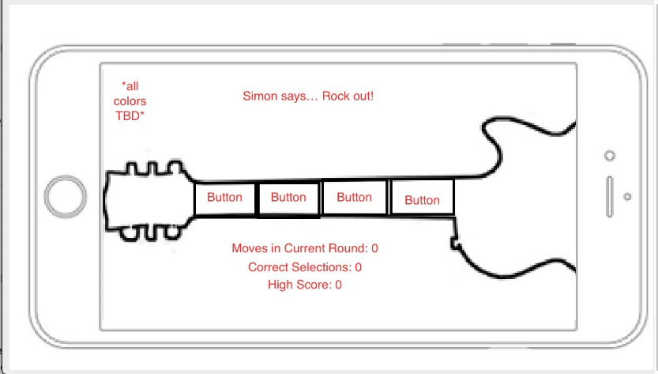

# Simon Game / Guitar Hero Edition

## Project Description

- I am going to create a "simon says" game / website that is styled like a "Guitar Hero" game. The computer selects one of four notes randomly, which light up one of four buttons across the guitar neck, each with a different guitar tone/chord (in a similar key). The user then has to replicate the same button selections. Each time the user replicates the computer's choices, the computer adds one additional note. This continues until the user messes up, in which the game ends.

## Project Link

- https://jake-utk.github.io/simon-guitar-project/

## Big Notes

- Start with mobile, work towards desktop with completed project.

## USER STORIES

- As a player, I need to see a 4 button selection grid / row, so that I can know where I can make my color selections.
- As a player, I need the board to light up as the computer makes selections, so I can see what pattern to emulate.
- As a player, I need the board to light up as I click my selections, so I can tell what pick I made.
- As a player, I need the pattern of selections the computer makes to be tracked, so that the winning sequence is recorded and can be compared against.
- As a player, I want my selections to be tracked, so that my sequence can be matched to the computer's to see if I passed the round.
- As a player, I need a turn indicator, so I know when it's my turn without having to keep track myself.
- As a player, I need the turns to alternate between player and computer, so that the rounds can be progressed.
- As a player, I want to see a message that tells me when the computer's turn is going on, so I know when to pay attention to the sequence on the game board.
- As a player, I need the game board to not be interactive while the computer's pattern is being shown, so that I cannot interrupt the computer's turn
- As a player, I need the game to recognize when I have correctly mimicked the computer's pattern, so that I know I've won the round.
- As a player, I need the game to recognize when I have incorrectly entered the computer's pattern, so that I know I've lost the round.
- As a player, I need to be informed when the game is over so that I can exit or restart.
- As a player, I want the board to be inactive after the game is over, so that I don't keep playing and change the result.
- As a player, I want a way to start the next round, so I can make sure I'm ready to observe the computer pattern.
- As a player, I want a "reset game" button, so if the user's feeble mind cannot handle the pattern they can reset without the embarrassment of a loss.

## Bronze Features

- As a player, I want to see how many total selections were in the computer's last pattern.
- As a player, I want to see how many correct selections I've made each turn as I select them, so I know how many more selections to make.

## Silver Features

- As a player, I would like a modal to pop up when I load into the page that briefly explains the instructions with a "ok let's play!" button.
- As a player, I would like a high score displayed on the game board, so I can try to beat it between reloads.

## Gold Features

- As a player, I want each selection to come with a unique musical sound, so there's a level of immersion into a "concert" environment. (#1 GOAL)
- As a player, I would like the game to be playable on desktop or mobile, so I can play 24/7 at home or on the go.
- As a player, I would like to be able to select between different instruments for different sound tones (perhaps an acoustic guitar or an electric guitar) for my button presses.
- As a player, I would like to hear some sort of background music, so there's further immersion into a "concert" environment. (Gold - honestly not sure how possible this is considering anything that isn't done in rhythm is going to sound ridiculous)
- As a player, I would like the option to use the 1, 2, 3, 4 keys to select buttons as oppose to clicks, in case my mouse dies from playing too much.
- A++ Goal, must have completed the last Gold Feature
    - Put a button over the strumming part of the guitar.  Require 1/2/3/4 + click of strum button to register a move, and make it light up for each of Simon's moves to simulate strumming.  Try to replicate this with two taps/clicks on mobile?

## Wire Frame

## Technologies Used

- HTML
- CSS
- Javascript

## Installation Instructions

- Fork Repo
- Clone it
- To contribute please make pull request!

## Embedded App Screenshot

- _This is one of the project requirements, add last before turn in_

## Unsolved Problems, Major Hurdles, and Reflections Along the Way...

- No unsolved problems, aside from hours in the day.
- Timing of sequence was a major hurdle; this was overcome.
- CSS remains a major hurdle.  I just have no idea what I'm doing, and didn't have time to learn during the scope of the project.
- CSS seems like an incredibly powerful language that we glossed over in about half a day in class.  I hadn't felt this extreme deficiency until now - this will certainly be a major focus of my self-learning as I continue past this course.

## Next Steps

- Actually learn CSS.
- Implement a break in the glow when simon picks the same value twice.
- Implement an invisible div (or some other method) to prevent user clicks during Simon's turn.
- 
